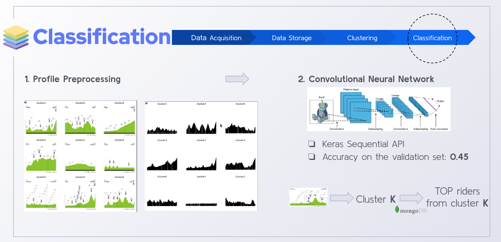

# cycling-seer

Final project made in Ironhack Data Analytics Aug '20 cohort.


## Objective

The objective of the project is to merge machine learning with one of my
passions: pro cycling. This is done by applying both unsupervised and supervised
learning techniques to riders and stages data gathered from the internet, in
order to build a tool capable of predicting the type of rider with the most
probability of winning a certain stage.

### How it works

_

## Project Development

### Outline


### 1. Data Aquisition

The whole dataset is scraped from
[procyclingstats.com](https://www.procyclingstats.com/). This is done via the
`scrape.py` tool. The scraping functions per se are contained in the
`src/procyclingstats.py` module. The tool is used as follows:

```bash
(ds) gontz@miair13:~/cycling-seer$ ./scrape.py --help
Usage: scrape.py [OPTIONS] ITEMS

  Scrape ITEMS from procyclingstats.com.

Options:
  -v, --verbose
  --help         Show this message and exit.
```

Example:

```bash
(ds) gontz@miair13:~/cycling-seer$ ./scrape.py -v stages
['vuelta-a-espana', 2019, 20] inserted with ID: 5f80163e50b3e70556f5324a
['vuelta-a-espana', 2019, 21] inserted with ID: 5f80164150b3e70556f5324b
['tirreno-adriatico', 2019, 1] is a team time trial. Skipping...
['tirreno-adriatico', 2019, 2] inserted with ID: 5f80164450b3e70556f5324c
['tirreno-adriatico', 2019, 3] inserted with ID: 5f80164650b3e70556f5324d
['tirreno-adriatico', 2019, 4] inserted with ID: 5f80164850b3e70556f5324e
['tirreno-adriatico', 2019, 5] inserted with ID: 5f80164a50b3e70556f5324f
['tirreno-adriatico', 2019, 6] inserted with ID: 5f80164c50b3e70556f53250
['tirreno-adriatico', 2019, 7] inserted with ID: 5f80164d50b3e70556f53251
['tirreno-adriatico', 2019, 8] could not be retrieved. Status code: 404
['tirreno-adriatico', 2020, 1] inserted with ID: 5f80165050b3e70556f53252
```

### 2. Data Storage

All the data regarding riders and stages is stored in a [*MongoDB*](https://www.mongodb.com/)
database. The operations involving database insertions and retrievals are
contained in the `src/dbops.py` module.

### 3. Clustering

The rider clustering is done through the *K-Means* algorithm in the
`notebooks/clustering.ipynb` jupyter notebook. In order to select the optimal
number of clusters, the *inertia* and *silhouette score* vs the number of
clusters *k* are plotted for different preprocessing strategies. To visualize
the clusters, rider features are reduced to 3D via
[*UMAP*](https://umap-learn.readthedocs.io/en/latest/).


### 4. Classification

After assigning each rider to its cluster (rider type), the stages are
condidered to belong to the stage winner's cluster. At this point, the
`download-prof.py` tool comes handy, as it downloads and places the profiles in
the directory (e.g. `cluster1`, `cluster2`) where they belong.

Then, a Convulutional Neural Network (CNN_) is trained using
[*TensorFlow*](https://www.tensorflow.org/), particularly `tf.keras`'s
sequential API, in the `notebooks/classification.ipynb` notebook. Prior to
feeding the profiles to the neural net, a thorough preprocessing is done in
order to reduce the noise (icons, text, RGB to GREY).



## Usage

A tool for making predictions, `cycling-seer.py`, is provided. The usage is as
follows:

```bash
(ds) [gontz@archlinux cycling-seer]$ ./cycling-seer.py --help
Usage: cycling-seer.py [OPTIONS] PROFILE

  Predict riders with most probability of winning stage with profile
  PROFILE.

Options:
  --help  Show this message and exit.
```

Example:

```bash
(ds) [gontz@archlinux cycling-seer]$ ./cycling-seer.py profile.jpg
-------------------Predicted cluster: 2 (0.2610403895378113)--------------------
------------------------Top active riders in cluster 2:-------------------------

        name                nationality	    weight	height	cluster	points.classic	points.gc   points.tt	points.sprint	points.climber	total_points
259	andre-greipel	    Germany	    75.0	184.0	2	4529	        1883	    504	        15646	        342	        22904
137	mark-cavendish	    Great Britain   70.0	175.0	2	2432	        1326	    678	        13573	        43	        18052
466	elia-viviani	    Italy	    67.0	178.0	2	4144	        866	    160	        8350	        320	        13840
376	nacer-bouhanni	    France	    65.0	175.0	2	3916	        449	    51	        8854	        376	        13646
202	jose-joaquin-rojas  Spain	    70.0	177.0	2	2805	        1869	    130	        5897	        1546	        12247
348	bryan-coquard	    France	    59.0	171.0	2	1995	        900	    289	        5532	        179	        8895
401	dylan-groenewegen   Netherlands	    70.0	177.0	2	2319	        249	    13	        6290	        10	        8881
135	heinrich-haussler   Australia	    NaN	        181.0	2	2758	        805	    276	        4256	        298	        8393
777	sacha-modolo	    Italy	    67.0	180.0	2	1691	        503	    19	        5948	        190	        8351
380	sam-bennett	    Ireland	    73.0	178.0	2	1764	        271	    41	        5670	        246	        7992
```

## Future Work

### Data Aquisition

Search for other data sources to gather more data.

### Clustering

Try different clustering algorithms (e.g. DBSCAN).

### Classification

Transition to `tf.keras`'s Functional API in order to feed mixed data to the
model.


